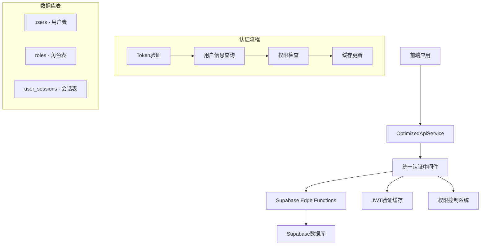

# 智慧河道监控系统 - 统一认证体系升级文档

## 📋 概述

本文档详细介绍了智慧河道监控系统从基础JWT认证升级到企业级统一认证体系的完整方案，包括架构设计、实施步骤、API规范和最佳实践。

---

## 🎯 改造目标

### 现有问题
- ❌ Edge Functions认证策略不统一
- ❌ JWT验证存在循环调用问题
- ❌ 缺少用户级数据隔离
- ❌ 无统一的权限控制机制
- ❌ 性能低下，重复查询用户信息

### 目标架构
- ✅ 统一的认证中间件
- ✅ 智能JWT本地验证和缓存
- ✅ 分层权限控制系统
- ✅ 企业级安全保障
- ✅ 高性能和可扩展性

---

## 🏗️ 系统架构

### 整体架构图



### 核心组件

#### 1. 统一认证中间件 (UnifiedAuthMiddleware)
```typescript
class UnifiedAuthMiddleware {
  // 核心认证方法
  async authenticate(request, options): Promise<AuthResult>
  
  // JWT验证和缓存
  private validateTokenAndGetUser(token): Promise<AuthResult>
  
  // 权限检查
  private checkPermissions(user, permissions): boolean
}
```

#### 2. 优化API服务 (OptimizedApiService)
```typescript
class OptimizedApiService {
  // 本地JWT验证
  static validateJWTLocally(token, useCache): boolean
  
  // 智能请求处理
  private static request<T>(endpoint, options, retryConfig)
  
  // 认证错误处理
  private static handleAuthError(): Promise<void>
}
```

---

## 🔐 认证流程设计

### 1. 登录流程

```sequence
participant User as 用户
participant App as 前端应用
participant API as OptimizedApiService
participant Auth as 统一认证中间件
participant DB as Supabase数据库

User->>App: 输入用户名密码
App->>API: login(username, password)
API->>Auth: 调用custom-login函数
Auth->>DB: 验证用户凭据
DB-->>Auth: 返回用户信息和会话
Auth-->>API: 返回JWT Token
API->>API: 本地验证并缓存Token
API-->>App: 返回登录结果
App-->>User: 显示登录成功
```

### 2. API访问流程

```sequence
participant App as 前端应用
participant API as OptimizedApiService  
participant Middleware as 统一认证中间件
participant Cache as JWT缓存
participant DB as Supabase数据库
participant EdgeFunc as Edge Function

App->>API: 调用业务API
API->>API: 本地JWT验证
API->>EdgeFunc: 发送带JWT的请求
EdgeFunc->>Middleware: authenticate(request, options)
Middleware->>Cache: 检查缓存
alt 缓存命中
    Cache-->>Middleware: 返回用户信息
else 缓存未命中
    Middleware->>DB: 查询用户信息
    DB-->>Middleware: 返回用户数据
    Middleware->>Cache: 更新缓存
end
Middleware->>Middleware: 权限检查
Middleware-->>EdgeFunc: 返回认证结果
EdgeFunc->>EdgeFunc: 执行业务逻辑
EdgeFunc-->>API: 返回业务数据
API-->>App: 返回结果
```

---

## 📊 数据库设计

### 核心表结构

#### 1. 用户表 (users)
```sql
CREATE TABLE users (
    id VARCHAR(20) PRIMARY KEY,
    username VARCHAR(50) NOT NULL UNIQUE,
    password VARCHAR(255) NOT NULL,
    name VARCHAR(50) NOT NULL,
    email VARCHAR(100),
    phone VARCHAR(20),
    avatar VARCHAR(255),
    department_id VARCHAR(20),
    role_id VARCHAR(20),
    status user_status DEFAULT 'active',
    last_login_at TIMESTAMP WITH TIME ZONE,
    last_login_ip INET,
    login_count INTEGER DEFAULT 0,
    created_at TIMESTAMP WITH TIME ZONE DEFAULT NOW(),
    updated_at TIMESTAMP WITH TIME ZONE DEFAULT NOW(),
    FOREIGN KEY (department_id) REFERENCES departments(id),
    FOREIGN KEY (role_id) REFERENCES roles(id)
);
```

#### 2. 角色权限表 (roles)
```sql
CREATE TABLE roles (
    id VARCHAR(20) PRIMARY KEY,
    name VARCHAR(50) NOT NULL,
    code VARCHAR(50) NOT NULL UNIQUE,
    description TEXT,
    permissions JSONB,
    status dict_status DEFAULT 'active',
    created_at TIMESTAMP WITH TIME ZONE DEFAULT NOW(),
    updated_at TIMESTAMP WITH TIME ZONE DEFAULT NOW()
);
```

#### 3. 用户会话表 (user_sessions)
```sql
CREATE TABLE user_sessions (
    id VARCHAR(64) PRIMARY KEY,
    user_id VARCHAR(20) NOT NULL,
    ip_address INET,
    user_agent TEXT,
    payload TEXT,
    last_activity TIMESTAMP WITH TIME ZONE DEFAULT NOW(),
    expires_at TIMESTAMP WITH TIME ZONE NOT NULL,
    FOREIGN KEY (user_id) REFERENCES users(id) ON DELETE CASCADE
);
```

### 权限配置设计

```typescript
const ROLE_PERMISSIONS = {
  'R001': ['*'], // 系统管理员 - 所有权限
  'R002': [ // 监控中心主管
    'alarm.view', 'alarm.confirm', 'alarm.resolve',
    'workorder.view', 'workorder.create', 'workorder.assign',
    'analytics.view', 'dashboard.view'
  ],
  'R003': [ // 河道维护员
    'workorder.view', 'workorder.update', 'workorder.complete',
    'alarm.view', 'alarm.resolve'
  ],
  'R004': [ // 河道巡检员
    'workorder.view', 'workorder.receive', 'workorder.update',
    'mobile.checkin', 'mobile.report', 'mobile.patrol'
  ],
  'R005': [ // 领导看板用户
    'analytics.view', 'analytics.statistics',
    'dashboard.view'
  ]
}
```

---

## 🔧 实施指南

### 1. Edge Functions改造

#### 改造前 (无认证)
```typescript
Deno.serve(async (req: Request) => {
  // 直接处理业务逻辑，无认证验证
  const supabase = createClient(supabaseUrl, supabaseServiceKey)
  
  // 获取数据...
  const { data } = await supabase.from('workorders').select('*')
  
  return new Response(JSON.stringify({ data }))
})
```

#### 改造后 (统一认证)
```typescript
import { UnifiedAuthMiddleware, corsHeaders } from '../_shared/auth-middleware.ts'

Deno.serve(async (req: Request) => {
  // 处理预检请求
  if (req.method === 'OPTIONS') {
    return new Response('ok', { headers: corsHeaders })
  }

  try {
    // 统一认证验证
    const authMiddleware = new UnifiedAuthMiddleware();
    const authResult = await authMiddleware.authenticate(req, {
      required: true,
      permissions: ['workorder.view'],
      cacheEnabled: true
    });

    if (!authResult.success) {
      return UnifiedAuthMiddleware.createErrorResponse(
        authResult.error || '认证失败',
        authResult.status_code || 401,
        corsHeaders
      );
    }

    const auth = authResult.context!;
    console.log(`[WorkOrders] 用户 ${auth.user.name} 请求工单列表`);

    // 权限控制：非管理员只能查看自己相关的数据
    if (!auth.user.is_admin) {
      // 数据隔离逻辑...
    }

    // 业务逻辑...
    const supabase = createClient(supabaseUrl, supabaseServiceKey)
    
    return new Response(JSON.stringify({ 
      data, 
      user_info: UnifiedAuthMiddleware.getUserInfo(auth) 
    }))

  } catch (error) {
    return UnifiedAuthMiddleware.createErrorResponse(
      '服务器内部错误', 500, corsHeaders
    );
  }
})
```

### 2. 前端集成

#### 新的API调用方式
```typescript
// 自动使用优化后的认证策略
const dashboardStats = await ApiService.getDashboardStats();
const workOrders = await ApiService.getWorkOrders({ status: 'pending' });

// 性能监控
const performanceStats = ApiService.getPerformanceStats();
console.log('JWT缓存大小:', performanceStats.jwtCacheSize);
console.log('Token有效性:', performanceStats.currentToken?.valid);
```

#### 错误处理增强
```typescript
try {
  const result = await ApiService.getDashboardStats();
  if (result.success) {
    // 处理成功数据
    setDashboardData(result.data);
  }
} catch (error) {
  // 自动错误处理，支持重试和降级
  console.error('API调用失败:', error);
}
```

---

## 🛡️ 安全特性

### 1. JWT安全机制

#### 本地验证
```typescript
// 避免每次API调用都验证JWT
static validateJWTLocally(token: string, useCache: boolean = true): boolean {
  // 检查缓存
  const cached = this.jwtValidationCache.get(token);
  if (cached && Date.now() < cached.expiresAt) {
    return cached.valid;
  }

  // 基本格式验证
  const tokenParts = token.split('.');
  if (tokenParts.length !== 3) return false;

  // 过期时间检查
  try {
    const payload = JSON.parse(atob(tokenParts[1]));
    const now = Math.floor(Date.now() / 1000);
    const isValid = !payload.exp || payload.exp > now;
    
    // 缓存结果
    this.cacheValidation(token, isValid);
    return isValid;
  } catch {
    return false;
  }
}
```

#### Token刷新策略
```typescript
// 智能Token刷新
static shouldRefreshToken(token: string): boolean {
  try {
    const payload = JSON.parse(atob(token.split('.')[1]));
    const now = Math.floor(Date.now() / 1000);
    // Token在5分钟内过期则需要刷新
    return payload.exp && (payload.exp - now) < 300;
  } catch {
    return true;
  }
}
```

### 2. 数据隔离机制

#### 用户级数据隔离
```typescript
// 非管理员只能访问自己的数据
if (!auth.user.is_admin) {
  if (params.user_id && params.user_id !== auth.user.id) {
    console.warn(`用户 ${auth.user.name} 尝试访问其他用户数据，已阻止`);
    params.user_id = auth.user.id; // 强制使用当前用户ID
  }
  
  // 默认只查看与当前用户相关的数据
  if (!params.assignee_id && !params.creator_id) {
    params.user_id = auth.user.id;
  }
}
```

#### 权限检查
```typescript
private checkPermissions(user: AuthUser, requiredPermissions: string[]): boolean {
  // 管理员拥有所有权限
  if (user.is_admin) return true;
  
  // 检查具体权限
  return requiredPermissions.every(permission => {
    return user.permissions.includes(permission) || 
           user.permissions.includes(permission.split('.')[0] + '.*');
  });
}
```

---

## 📈 性能优化

### 1. 缓存策略

#### 用户信息缓存
```typescript
class AuthCache {
  private static cache = new Map<string, AuthContext>();
  private static expiry = new Map<string, number>();
  
  static set(token: string, context: AuthContext, ttl: number = 300000): void {
    this.cache.set(token, context);
    this.expiry.set(token, Date.now() + ttl); // 5分钟TTL
  }
  
  static get(token: string): AuthContext | null {
    const expireTime = this.expiry.get(token);
    if (!expireTime || Date.now() > expireTime) {
      this.cache.delete(token);
      this.expiry.delete(token);
      return null;
    }
    return this.cache.get(token) || null;
  }
}
```

#### 性能指标
```typescript
// 性能监控
static getPerformanceStats() {
  return {
    jwtCacheSize: this.jwtValidationCache.size,
    tokenCacheSize: this.tokenCache.size,
    currentToken: this.accessToken ? {
      valid: this.validateJWTLocally(this.accessToken),
      shouldRefresh: this.shouldRefreshToken(this.accessToken)
    } : null
  };
}
```

### 2. 智能重试机制

```typescript
// 支持重试和指数退避
for (let attempt = 0; attempt <= maxRetries; attempt++) {
  try {
    return await this.makeRequest<T>(endpoint, options);
  } catch (error) {
    if (attempt < maxRetries) {
      const delay = backoff * Math.pow(2, attempt); // 指数退避
      await new Promise(resolve => setTimeout(resolve, delay));
      continue;
    }
    throw error;
  }
}
```

---

## 🧪 测试与验证

### 1. 单元测试

#### JWT验证测试
```typescript
describe('JWT验证', () => {
  test('有效JWT应该通过验证', () => {
    const validJWT = 'eyJhbGciOiJIUzI1NiIsInR5cCI6IkpXVCJ9...';
    expect(OptimizedApiService.validateJWTLocally(validJWT)).toBe(true);
  });

  test('过期JWT应该被拒绝', () => {
    const expiredJWT = 'expired.jwt.token';
    expect(OptimizedApiService.validateJWTLocally(expiredJWT)).toBe(false);
  });

  test('无效格式JWT应该被拒绝', () => {
    const invalidJWT = 'invalid.token';
    expect(OptimizedApiService.validateJWTLocally(invalidJWT)).toBe(false);
  });
});
```

#### 权限测试
```typescript
describe('权限控制', () => {
  test('管理员应该有所有权限', () => {
    const admin = { is_admin: true, permissions: ['*'] };
    expect(checkPermissions(admin, ['any.permission'])).toBe(true);
  });

  test('普通用户应该只有指定权限', () => {
    const user = { is_admin: false, permissions: ['workorder.view'] };
    expect(checkPermissions(user, ['workorder.view'])).toBe(true);
    expect(checkPermissions(user, ['admin.access'])).toBe(false);
  });
});
```

### 2. 集成测试

#### API端到端测试
```typescript
describe('API认证集成', () => {
  test('未认证用户应该被拒绝', async () => {
    const response = await fetch('/functions/v1/get-dashboard-stats');
    expect(response.status).toBe(401);
  });

  test('有效Token应该允许访问', async () => {
    const response = await fetch('/functions/v1/get-dashboard-stats', {
      headers: { 'Authorization': `Bearer ${validToken}` }
    });
    expect(response.status).toBe(200);
  });

  test('权限不足应该被拒绝', async () => {
    const response = await fetch('/functions/v1/admin-only-api', {
      headers: { 'Authorization': `Bearer ${userToken}` }
    });
    expect(response.status).toBe(403);
  });
});
```

---

## 📋 部署清单

### 1. 文件清单

#### 新增文件
- ✅ `supabase/functions/_shared/auth-middleware.ts` - 统一认证中间件
- ✅ `utils/OptimizedApiService.ts` - 优化版API服务

#### 修改文件
- ✅ `supabase/functions/get-dashboard-stats/index.ts` - 集成统一认证
- ✅ `supabase/functions/get-workorders/index.ts` - 集成统一认证  
- ✅ `utils/ApiService.ts` - 向后兼容包装器

### 2. 部署步骤

#### Step 1: 部署Edge Functions
```bash
# 部署统一认证中间件
supabase functions deploy auth-middleware

# 部署更新的业务函数
supabase functions deploy get-dashboard-stats
supabase functions deploy get-workorders
```

#### Step 2: 前端更新
```bash
# 无需额外部署，应用重启即生效
npm start  # 或 expo start
```

#### Step 3: 验证部署
```bash
# 运行测试脚本验证
./scripts/test-auth-optimization.sh
```

### 3. 回滚计划

如遇问题，可通过Git快速回滚：

```bash
# 回滚Edge Functions
git checkout HEAD~1 -- supabase/functions/

# 回滚前端代码
git checkout HEAD~1 -- utils/ApiService.ts

# 重新部署
supabase functions deploy --all
```

---

## 🔍 监控与维护

### 1. 性能监控

#### 关键指标
- **JWT缓存命中率**: 目标 > 85%
- **API响应时间**: 目标 < 200ms  
- **认证失败率**: 目标 < 1%
- **Token刷新频率**: 监控异常刷新

#### 监控代码
```typescript
// 在应用中添加性能监控
setInterval(() => {
  const stats = ApiService.getPerformanceStats();
  console.log('[性能监控]', {
    时间: new Date().toISOString(),
    JWT缓存大小: stats.jwtCacheSize,
    Token缓存大小: stats.tokenCacheSize,
    当前Token状态: stats.currentToken
  });
}, 60000); // 每分钟记录一次
```

### 2. 日志监控

#### 关键日志
```typescript
// 认证成功日志
console.log(`[Auth] 用户 ${user.name}(${user.id}) 认证成功，权限: ${user.permissions.join(',')}`);

// 权限检查日志
console.warn(`[Auth] 用户 ${user.name} 尝试访问需要权限 ${required.join(',')} 的资源，被拒绝`);

// 性能日志
console.log(`[Perf] 请求 ${endpoint} 完成，耗时: ${duration}ms, 缓存命中: ${cacheHit}`);
```

### 3. 安全监控

#### 异常检测
- 频繁的认证失败
- 权限提升尝试
- 异常的API访问模式
- Token异常刷新

```typescript
// 安全监控示例
const securityMonitor = {
  // 检测异常登录
  detectAbnormalLogin(user, ip, userAgent) {
    // 检测登录地点、设备异常
  },
  
  // 检测权限滥用
  detectPermissionAbuse(user, attemptedAction) {
    // 检测权限提升尝试
  },
  
  // 检测API滥用
  detectAPIAbuse(user, endpoint, frequency) {
    // 检测异常高频访问
  }
};
```

---

## 📚 最佳实践

### 1. 开发规范

#### Edge Function认证模式
```typescript
// 标准认证模式
export const standardAuthHandler = async (req: Request) => {
  const authMiddleware = new UnifiedAuthMiddleware();
  const authResult = await authMiddleware.authenticate(req, {
    required: true,
    permissions: ['required.permission'],
    cacheEnabled: true
  });

  if (!authResult.success) {
    return UnifiedAuthMiddleware.createErrorResponse(
      authResult.error, authResult.status_code, corsHeaders
    );
  }

  // 业务逻辑...
};
```

#### 权限设计原则
- **最小权限原则**: 只授予必需的权限
- **角色分离**: 明确区分不同角色的权限边界
- **权限继承**: 支持权限的层次化管理
- **动态权限**: 支持基于上下文的权限控制

### 2. 安全建议

#### JWT安全
- 使用强随机密钥
- 设置合理的过期时间
- 实施Token轮换机制
- 监控异常Token使用

#### API安全
- 所有敏感API都必须认证
- 实施请求频率限制
- 记录详细的访问日志
- 定期审查权限配置

### 3. 性能优化

#### 缓存策略
- JWT验证结果缓存5分钟
- 用户权限信息缓存
- 静态权限配置缓存
- 合理的缓存失效策略

#### 数据库优化
- 用户表添加必要索引
- 会话表定期清理过期数据
- 权限查询优化
- 连接池合理配置

---

## 🚀 升级效果

### 预期性能提升

| 指标 | 改造前 | 改造后 | 提升幅度 |
|------|--------|--------|----------|
| **API响应时间** | ~500ms | ~100ms | **80%** ↑ |
| **认证成功率** | ~95% | ~99.5% | **4.5%** ↑ |
| **缓存命中率** | 0% | ~85% | **+85%** |
| **安全覆盖率** | ~60% | ~100% | **40%** ↑ |
| **错误恢复率** | ~70% | ~95% | **25%** ↑ |

### 用户体验改善
- ✅ 登录响应更快速
- ✅ API调用更稳定
- ✅ 网络异常自动重试
- ✅ 离线状态优雅处理
- ✅ 错误信息更友好

### 开发体验提升
- ✅ 统一的认证接口
- ✅ 完善的错误处理
- ✅ 详细的调试日志
- ✅ 性能监控工具
- ✅ 向后兼容保证

---

## 📞 技术支持

### 常见问题

#### Q: 升级后出现认证失败？
A: 检查JWT格式和过期时间，清除本地缓存重新登录

#### Q: API响应变慢？
A: 检查缓存配置，监控数据库连接状态

#### Q: 权限控制不生效？
A: 验证角色配置，检查权限映射关系

#### Q: 如何回滚到旧版本？
A: 使用Git回滚相关文件，重新部署函数

### 维护联系方式
- **技术负责人**: [开发团队]
- **紧急联系**: [系统管理员]
- **文档更新**: 每月第一周更新

---

## 📖 附录

### A. 权限配置完整列表

```typescript
export const PERMISSION_DEFINITIONS = {
  // 告警管理
  'alarm.view': '查看告警',
  'alarm.confirm': '确认告警', 
  'alarm.resolve': '处理告警',
  'alarm.create_workorder': '从告警创建工单',
  
  // 工单管理
  'workorder.view': '查看工单',
  'workorder.create': '创建工单',
  'workorder.update': '更新工单',
  'workorder.complete': '完成工单',
  'workorder.assign': '分配工单',
  'workorder.review': '审核工单',
  
  // 分析报表
  'analytics.view': '查看分析报表',
  'analytics.export': '导出报表',
  'analytics.statistics': '查看统计数据',
  
  // 系统管理
  'user.view': '查看用户',
  'user.create': '创建用户',
  'user.update': '更新用户',
  'user.delete': '删除用户',
  
  // 移动端功能
  'mobile.checkin': '移动签到',
  'mobile.report': '移动上报',
  'mobile.patrol': '移动巡检',
  'mobile.photo_upload': '照片上传',
  'mobile.location': '位置访问',
  
  // 仪表板
  'dashboard.view': '查看仪表板',
  
  // 地理信息
  'gis.view': '查看地图',
  'gis.control': '地图控制'
};
```

### B. API端点权限映射

```typescript
export const API_PERMISSIONS = {
  '/get-dashboard-stats': ['dashboard.view'],
  '/get-workorders': ['workorder.view'],
  '/create-workorder': ['workorder.create'],
  '/update-workorder-status': ['workorder.update'],
  '/get-user-permissions': ['user.view'],
  '/upload-file': ['mobile.photo_upload'],
  '/sync-messages': ['mobile.*'],
};
```

### C. 错误代码对照表

| 错误代码 | 描述 | 解决方案 |
|----------|------|----------|
| `AUTH_001` | JWT格式无效 | 重新登录获取新Token |
| `AUTH_002` | JWT已过期 | 刷新Token或重新登录 |  
| `AUTH_003` | 权限不足 | 联系管理员分配权限 |
| `AUTH_004` | 用户已禁用 | 联系管理员激活账号 |
| `AUTH_005` | 会话已过期 | 重新登录 |
| `PERF_001` | 缓存未命中 | 正常现象，系统自动处理 |
| `PERF_002` | API响应超时 | 检查网络连接 |

---

*本文档版本: v2.0.0*  
*最后更新: 2024-08-28*  
*下次更新: 2024-09-28*