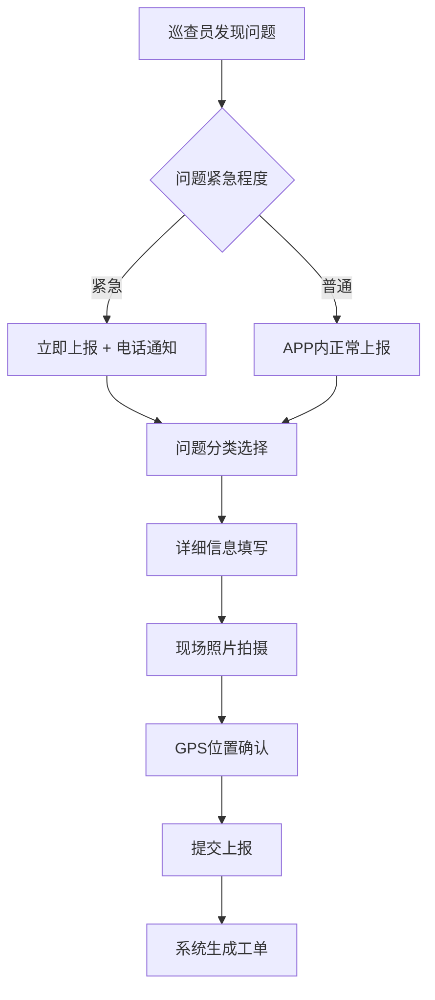
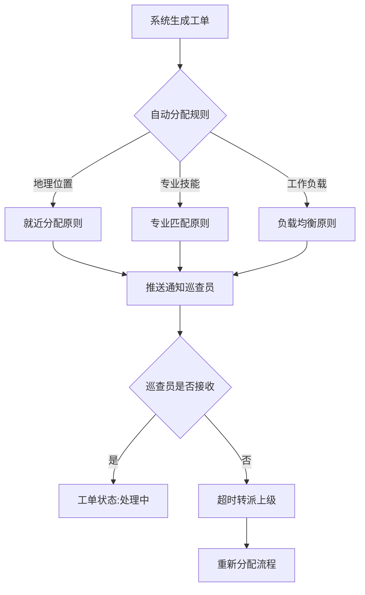
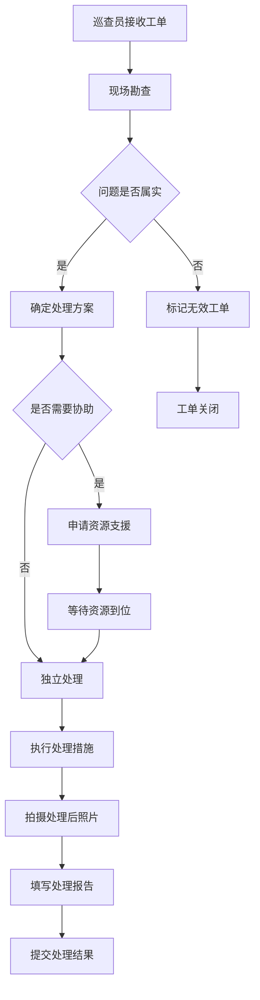
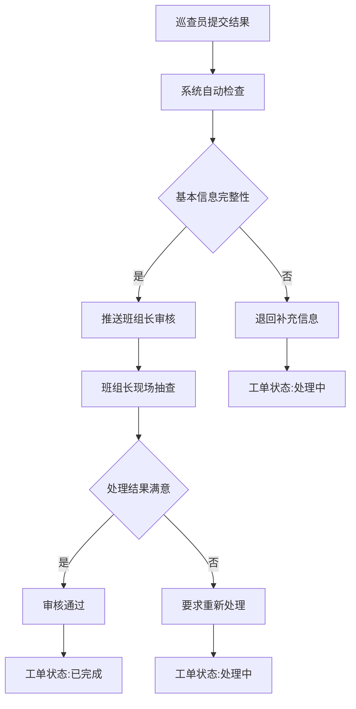
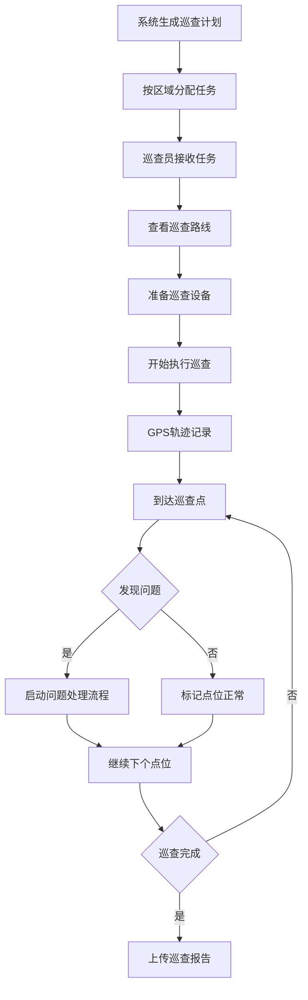
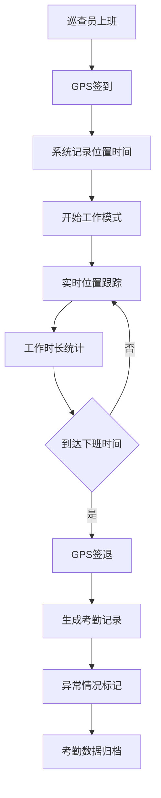
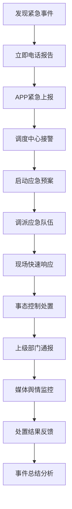

# 智慧河道巡查系统 - 业务流程设计

## 1. 核心业务流程概览

### 1.1 主要业务流程
- **问题发现处理流程**: 发现问题 → 分类上报 → 工单创建 → 分配处理 → 结果审核 → 归档跟踪
- **日常巡查流程**: 任务规划 → 路径导航 → 现场巡查 → 问题记录 → 轨迹上传 → 考勤统计
- **应急响应流程**: 紧急事件 → 快速上报 → 即时响应 → 现场处置 → 结果反馈 → 总结改进
- **数据管理流程**: 数据收集 → 质量检查 → 分析处理 → 报表生成 → 决策支持

### 1.2 流程参与角色
- **巡查员**: 一线执行人员
- **班组长**: 现场管理人员  
- **区域主管**: 区域负责人
- **调度中心**: 统一调度协调
- **系统管理员**: 技术支持人员

## 2. 详细业务流程

### 2.1 问题发现处理流程

#### 2.1.1 问题发现阶段

**关键节点说明:**
- **问题发现**: 巡查员通过定期巡查或市民举报发现问题
- **紧急判断**: 涉及安全、环境污染等紧急问题需立即处理
- **信息采集**: 确保问题描述准确、照片清晰、位置精确
- **工单生成**: 系统自动分配工单号，记录完整信息

#### 2.1.2 工单分配阶段

**分配规则优先级:**
1. **紧急工单**: 立即分配最近可用人员
2. **专业工单**: 优先分配有相关技能人员
3. **普通工单**: 按区域和负载均衡分配
4. **超时处理**: 2小时未接收自动升级

#### 2.1.3 问题处理阶段

**处理标准:**
- **现场确认**: 必须到现场核实问题真实性
- **方案制定**: 根据问题类型选择合适处理方式
- **资源调配**: 超出个人能力范围及时申请支援
- **结果记录**: 处理前后对比照片 + 详细文字说明

#### 2.1.4 结果审核阶段  

**审核要点:**
- **完整性检查**: 照片、描述、位置信息完整
- **真实性验证**: 现场抽查验证处理效果
- **质量评估**: 处理方式合理性和效果持续性
- **时效考核**: 处理时间是否符合要求

### 2.2 日常巡查流程

#### 2.2.1 巡查任务规划

**巡查要求:**
- **覆盖率**: 责任区域100%覆盖，重点区域加密巡查
- **频次要求**: 一般区域周巡查，重点区域日巡查
- **轨迹记录**: 完整GPS轨迹，确保巡查真实性
- **时间管控**: 巡查时间不少于规定时长

#### 2.2.2 考勤管理流程

### 2.3 应急响应流程

#### 2.3.1 紧急事件处理

**应急标准:**
- **响应时间**: 接警后30分钟内到达现场
- **处置要求**: 先控制事态，再彻底处理
- **信息报送**: 重大事件1小时内报告上级
- **舆情管控**: 及时发布权威信息，引导舆论

## 3. 流程监控与优化

### 3.1 关键指标监控
- **时效性指标**:
  - 问题发现到上报时间 ≤ 30分钟
  - 工单接收响应时间 ≤ 2小时  
  - 问题处理完成时间 ≤ 24小时
  - 审核反馈时间 ≤ 4小时

- **质量性指标**:
  - 工单信息完整率 ≥ 95%
  - 处理结果合格率 ≥ 90%
  - 一次性通过率 ≥ 85%
  - 问题复发率 ≤ 5%

- **效率性指标**:
  - 巡查覆盖率 ≥ 100%
  - 人均日处理工单数 ≥ 8个
  - 设备利用率 ≥ 80%
  - 系统可用率 ≥ 99.9%

### 3.2 流程持续优化

#### 3.2.1 数据驱动优化
- **瓶颈识别**: 通过数据分析识别流程瓶颈点
- **效率提升**: 优化高频操作的用户体验
- **资源配置**: 基于工作量数据优化人员配置
- **预测分析**: 预测问题高发区域和时段

#### 3.2.2 用户反馈优化
- **用户调研**: 定期收集用户使用反馈
- **流程简化**: 简化复杂操作流程
- **功能增强**: 根据需求增加实用功能
- **培训改进**: 优化用户培训内容和方式

### 3.3 应急预案

#### 3.3.1 系统故障应急
- **故障等级**: 分为一般、重要、严重、灾难四个等级
- **响应时间**: 分别要求4小时、2小时、1小时、30分钟内响应
- **处理流程**: 故障发现 → 等级判定 → 应急响应 → 问题修复 → 总结改进
- **备用方案**: 离线模式 + 电话热线 + 纸质记录

#### 3.3.2 数据安全应急
- **数据备份**: 实时备份 + 定期异地备份
- **安全事件**: 发现安全威胁立即隔离系统
- **恢复流程**: 评估损失 → 数据恢复 → 系统加固 → 安全审计
- **报告机制**: 重大安全事件24小时内报告相关部门

## 4. 流程文档管理

### 4.1 文档体系
- **流程图**: 标准业务流程图和操作指导
- **制度规范**: 管理制度和操作规范文档
- **应急预案**: 各类应急情况处理预案
- **培训资料**: 用户培训教材和操作手册

### 4.2 版本管理
- **版本控制**: 所有流程文档版本化管理
- **变更审批**: 流程变更需要相关领导审批
- **实施通知**: 新流程实施前提前通知培训
- **执行监督**: 定期检查流程执行情况

### 4.3 持续改进
- **定期评估**: 季度流程有效性评估
- **改进建议**: 收集各级用户改进建议  
- **试点推广**: 新流程先试点再全面推广
- **效果评估**: 改进后效果跟踪评估

---

**文档版本**: v1.0  
**最后更新**: 2024-01-20  
**维护团队**: 业务流程团队  
**审批状态**: 待审批