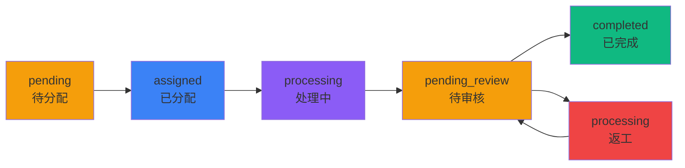

# 移动端APP工单流转API文档

## 概述
本文档描述智慧河道巡查系统移动端APP的工单流转相关API接口，包括工单列表查询、工单详情查看、工单状态更新等功能。

## 状态流转图



## 角色权限说明

| 角色ID | 角色名称 | 查看权限 | 操作权限 |
|--------|----------|----------|----------|
| R001 | 系统管理员 | 所有工单 | 分配、审核、取消 |
| R002 | 监控中心主管 | 所有工单 | 分配、审核、取消 |
| R003 | 河道维护员 | 分配给自己的工单 | 开始处理、提交结果 |
| R004 | 河道巡检员 | 自己创建的和分配给自己的工单 | 开始处理、提交结果 |
| R005 | 领导看板用户 | 所有工单 | 无 |
| R006 | 河道维护员主管 | 自己管理区域的工单 | 分配(本区域)、审核(本区域)、取消(本区域) |

## API接口

### 1. 获取工单列表

**接口地址**: `GET /api/app-workorders`

**请求参数**:
```typescript
{
  status?: string;        // 状态筛选: all, pending, assigned, processing, pending_review, completed, cancelled
  assignee_id?: string;   // 处理人ID
  department_id?: string; // 部门ID
  area_id?: string;       // 区域ID
  search?: string;        // 搜索关键词
  page?: number;          // 页码，默认1
  limit?: number;         // 每页数量，默认50
}
```

**请求头**:
```http
Authorization: Bearer {access_token}
// 或者通过Cookie
Cookie: app-auth-token={jwt_token}
```

**响应示例**:
```json
{
  "success": true,
  "data": {
    "items": [
      {
        "id": "WO_20240909_0001",
        "title": "河道垃圾清理",
        "description": "东区河道发现大量垃圾堆积",
        "type": "垃圾",
        "typeName": "垃圾清理",
        "status": "processing",
        "priority": "紧急",
        "location": "东区河道第3段",
        "time": "2小时前",
        "createdAt": "2024-09-09T10:00:00Z",
        "creator": {
          "id": "USR001",
          "name": "张三",
          "username": "inspector001"
        },
        "assignee": {
          "id": "USR002",
          "name": "李四",
          "username": "maintainer001"
        },
        "area": {
          "id": "AREA001",
          "name": "东区",
          "code": "EAST"
        },
        "department": {
          "id": "DEPT001",
          "name": "维护部",
          "code": "MAINTAIN"
        }
      }
    ],
    "pagination": {
      "page": 1,
      "limit": 50,
      "total": 100,
      "totalPages": 2
    }
  },
  "message": "获取工单列表成功"
}
```

### 2. 获取工单详情

**接口地址**: `GET /api/app-workorders/{id}`

**请求头**:
```http
Authorization: Bearer {access_token}
```

**响应示例**:
```json
{
  "success": true,
  "data": {
    "id": "WO_20240909_0001",
    "title": "河道垃圾清理",
    "description": "东区河道发现大量垃圾堆积，需要紧急清理",
    "type": {
      "id": "WT001",
      "name": "垃圾清理",
      "category": "垃圾"
    },
    "status": "processing",
    "priority": "urgent",
    "location": "东区河道第3段",
    "coordinates": {
      "latitude": 31.2304,
      "longitude": 121.4737
    },
    "creator": {
      "id": "USR001",
      "name": "张三",
      "username": "inspector001"
    },
    "assignee": {
      "id": "USR002",
      "name": "李四",
      "username": "maintainer001"
    },
    "area": {
      "id": "AREA001",
      "name": "东区",
      "code": "EAST"
    },
    "status_history": [
      {
        "id": "WSH001",
        "old_status": null,
        "new_status": "pending",
        "changed_by": "USR001",
        "change_reason": "创建工单",
        "created_at": "2024-09-09T10:00:00Z",
        "user": {
          "name": "张三",
          "username": "inspector001"
        }
      },
      {
        "id": "WSH002",
        "old_status": "pending",
        "new_status": "assigned",
        "changed_by": "USR006",
        "change_reason": "分配给李四处理",
        "created_at": "2024-09-09T10:30:00Z",
        "user": {
          "name": "王五",
          "username": "supervisor001"
        }
      }
    ],
    "created_at": "2024-09-09T10:00:00Z",
    "assigned_at": "2024-09-09T10:30:00Z",
    "started_at": "2024-09-09T11:00:00Z"
  },
  "message": "获取工单详情成功"
}
```

### 3. 更新工单状态

**接口地址**: `PUT /api/app-workorders/{id}`

**请求参数**:
```typescript
{
  action: 'assign' | 'start' | 'submit_result' | 'approve' | 'reject' | 'cancel';
  note?: string;           // 备注说明
  attachments?: string[];  // 附件URL列表
  assigneeId?: string;     // 分配给的处理人ID (仅assign时需要)
  processResult?: {        // 处理结果 (仅submit_result时使用)
    method: string;        // 处理方法
    result: string;        // 处理结果描述
    beforePhotos: string[]; // 处理前照片
    afterPhotos: string[];  // 处理后照片
    needFollowup: boolean; // 是否需要跟进
    followupReason?: string; // 跟进原因
  }
}
```

**状态操作示例**:

#### 3.1 分配工单 (assign)
```json
{
  "action": "assign",
  "assigneeId": "USR002",
  "note": "分配给李四处理"
}
```

#### 3.2 开始处理 (start)
```json
{
  "action": "start",
  "note": "开始处理工单"
}
```

#### 3.3 提交处理结果 (submit_result)
```json
{
  "action": "submit_result",
  "note": "垃圾已清理完成",
  "attachments": [
    "https://storage/after_photo1.jpg",
    "https://storage/after_photo2.jpg"
  ],
  "processResult": {
    "method": "人工清理",
    "result": "已清理完成，河道恢复正常",
    "beforePhotos": ["https://storage/before1.jpg"],
    "afterPhotos": ["https://storage/after1.jpg"],
    "needFollowup": false
  }
}
```

#### 3.4 审核通过 (approve)
```json
{
  "action": "approve",
  "note": "处理结果符合要求，审核通过"
}
```

#### 3.5 审核拒绝/打回 (reject)
```json
{
  "action": "reject",
  "note": "清理不彻底，请重新处理"
}
```

#### 3.6 取消工单 (cancel)
```json
{
  "action": "cancel",
  "note": "重复工单，取消处理"
}
```

**响应示例**:
```json
{
  "success": true,
  "data": {
    "workorder": {
      "id": "WO_20240909_0001",
      "status": "pending_review",
      "updated_at": "2024-09-09T14:00:00Z"
    },
    "oldStatus": "processing",
    "newStatus": "pending_review",
    "action": "submit_result"
  },
  "message": "工单状态更新成功"
}
```

## 完整流程示例

### 正常流程
1. **创建工单**: 巡检员发现问题，创建工单 (status: pending)
2. **分配工单**: 区域主管分配给维护员 (pending → assigned)
3. **开始处理**: 维护员接收并开始处理 (assigned → processing)
4. **提交结果**: 维护员完成处理，提交结果 (processing → pending_review)
5. **审核通过**: 区域主管审核通过 (pending_review → completed)

### 打回流程
1. **提交结果**: 维护员提交处理结果 (processing → pending_review)
2. **审核拒绝**: 区域主管认为处理不达标，打回 (pending_review → processing)
3. **重新处理**: 维护员重新处理问题
4. **再次提交**: 维护员再次提交结果 (processing → pending_review)
5. **审核通过**: 区域主管审核通过 (pending_review → completed)

## 错误码说明

| 错误码 | 说明 |
|--------|------|
| 401 | 未登录或会话已过期 |
| 403 | 无权限执行此操作 |
| 404 | 工单不存在 |
| 400 | 请求参数错误或状态不允许此操作 |
| 500 | 服务器内部错误 |

## 测试账号

| 账号 | 密码 | 角色 | 权限说明 |
|------|------|------|----------|
| admin001 | password | 系统管理员 | 查看所有工单，可分配、审核、取消 |
| monitor001 | password | 监控中心主管 | 查看所有工单，可分配、审核、取消 |
| maintainer001 | password | 河道维护员 | 只看分配给自己的工单，可处理 |
| inspector001 | password | 河道巡检员 | 看自己创建和分配给自己的工单 |
| supervisor001 | password | 东区主管 | 只看东区工单，可分配、审核东区工单 |

## 注意事项

1. **认证方式**: 支持Bearer Token和Cookie两种方式，移动端推荐使用Bearer Token
2. **区域隔离**: R006角色(区域主管)只能查看和操作自己管理区域的工单
3. **状态约束**: 工单状态转换必须遵循定义的流程，不能跳跃状态
4. **权限检查**: 每个操作都会验证用户角色和权限，无权限会返回403错误
5. **数据完整性**: 所有状态变更都会记录在status_history表中，可追溯
