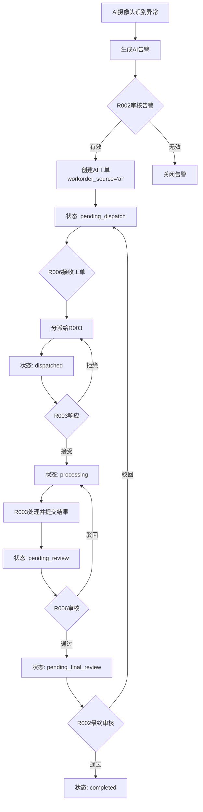
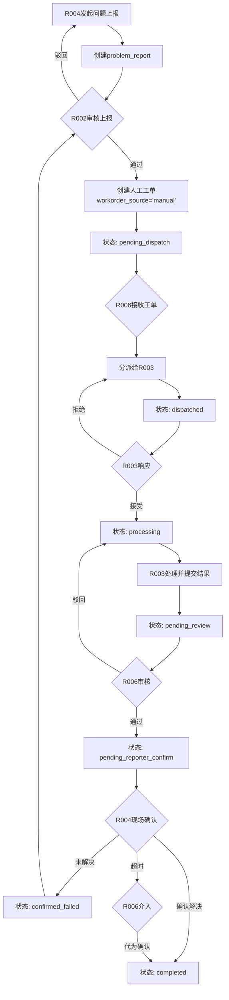

# 智慧河道监控系统 - 工单流转系统文档

## 一、系统概述

### 1.1 系统架构
- **前端**：React Native + Expo (移动端APP)
- **中间层**：Next.js API Routes (接口中转)
- **后端**：Supabase (PostgreSQL数据库)
- **状态管理**：基于枚举类型的状态机设计

### 1.2 核心概念
- **工单来源**：AI告警工单、人工上报工单、系统工单
- **状态流转**：通过预定义的状态映射控制工单生命周期
- **角色权限**：基于角色ID (R001-R006) 的权限控制体系

## 二、角色定义与权限

### 2.1 系统角色

| 角色ID | 角色名称 | 角色代码 | 主要职责 |
|--------|---------|----------|---------|
| R001 | 系统管理员 | ADMIN | 系统配置、用户管理、全局权限 |
| R002 | 监控中心主管 | MONITOR_SUPERVISOR | 告警审核、工单创建、最终审核 |
| R003 | 河道维护员 | RIVER_MAINTAINER | 工单执行、现场处理、结果反馈 |
| R004 | 河道巡检员 | RIVER_INSPECTOR | 问题上报、现场确认、工单发起 |
| R005 | 领导看板用户 | DASHBOARD_VIEWER | 查看统计、监控大屏 |
| R006 | 区域管理员 | AREA_MANAGER | 工单分派、区域审核、超时处理 |

### 2.2 权限矩阵

| 操作 | R001 | R002 | R003 | R004 | R005 | R006 |
|-----|------|------|------|------|------|------|
| 创建问题上报 | ✓ | ✓ | - | ✓ | - | ✓ |
| 审核问题上报 | ✓ | ✓ | - | - | - | - |
| 创建工单 | ✓ | ✓ | - | ✓ | - | ✓ |
| 分派工单 | ✓ | ✓ | - | - | - | ✓ |
| 处理工单 | ✓ | - | ✓ | - | - | - |
| 区域审核 | ✓ | - | - | - | - | ✓ |
| 最终审核 | ✓ | ✓ | - | - | - | - |
| 发起人确认 | ✓ | - | - | ✓ | - | ✓* |

*R006在R004超时未确认时可介入

## 三、工单状态定义

### 3.1 完整状态列表

```sql
-- 数据库中定义的工单状态枚举
CREATE TYPE workorder_status AS ENUM (
    'pending',                    -- 待处理
    'pending_dispatch',           -- 待分派
    'dispatched',                -- 已分派  
    'assigned',                  -- 已分配
    'processing',                -- 处理中
    'pending_review',            -- 待审核
    'reviewing',                 -- 审核中
    'pending_final_review',      -- 待最终审核
    'pending_reporter_confirm',  -- 待发起人确认
    'confirmed_failed',          -- 确认失败
    'approved',                  -- 已通过
    'rejected',                  -- 已驳回
    'completed',                 -- 已完成
    'cancelled'                  -- 已取消
);
```

### 3.2 状态流转映射

```javascript
// 用户动作 -> 工单状态的映射关系
const statusMapping = {
  'reject': 'rejected',              // 拒绝 → 已驳回
  'accept': 'pending_dispatch',      // 接受 → 待分派
  'dispatch': 'dispatched',          // 分派 → 已分派
  'start_processing': 'processing',  // 开始处理 → 处理中
  'submit_review': 'pending_review', // 提交审核 → 待审核
  'approve_review': 'pending_final_review', // 审核通过 → 待最终审核
  'reject_review': 'processing',     // 审核驳回 → 退回处理中
  'final_approve': 'completed',      // 最终批准 → 已完成
  'final_reject': 'rejected',        // 最终拒绝 → 已驳回
  'reporter_confirm': 'completed',   // 发起人确认 → 已完成
  'reporter_reject': 'confirmed_failed', // 发起人拒绝 → 确认失败
  'close': 'completed'               // 关闭 → 已完成
}
```

## 四、AI工单处理流程

### 4.1 流程图



### 4.2 关键数据库字段

```sql
-- AI工单特有字段
workorder_source: 'ai'              -- 工单来源
alarm_id: VARCHAR(20)               -- 关联的AI告警ID
creator_id: R002用户ID              -- 创建人(监控中心主管)
dispatcher_id: R006用户ID           -- 分派人(区域管理员)
assignee_id: R003用户ID             -- 执行人(维护员)
area_reviewer_id: R006用户ID        -- 区域审核人
final_reviewer_id: R002用户ID       -- 最终审核人
```

## 五、人工工单处理流程

### 5.1 流程图



### 5.2 关键数据库字段

```sql
-- 人工工单特有字段
workorder_source: 'manual'          -- 工单来源
report_id: VARCHAR(20)               -- 关联的问题上报ID
initial_reporter_id: R004用户ID     -- 初始上报人
reporter_confirmed_at: TIMESTAMP     -- 发起人确认时间
reporter_confirm_note: TEXT          -- 发起人确认备注
reporter_confirm_result: VARCHAR(20) -- 确认结果(confirmed/rejected/timeout)
timeout_intervener_id: R006用户ID   -- 超时介入人
```

## 六、API接口设计

### 6.1 现有API接口

| 接口路径 | 方法 | 功能 | 角色限制 |
|---------|------|------|----------|
| /api/app-auth/login | POST | 用户登录 | 所有角色 |
| /api/app-problem-report | POST | 创建问题上报 | R004 |
| /api/app-workorder-create | POST | 创建工单 | R004 |
| /api/app-workorders | GET | 获取工单列表 | 基于角色过滤 |
| /api/app-workorder-process | POST | 提交处理结果 | R003 |
| /api/app-notifications | GET/POST | 通知管理 | 所有角色 |
| /api/app-dashboard-stats | GET | 统计数据 | 所有角色 |

### 6.2 需要补充的API接口

```typescript
// 1. 问题上报审核接口 (R002)
POST /api/app-problem-review
{
  report_id: string,
  action: 'approve' | 'reject',
  note: string,
  create_workorder: boolean  // 是否转为工单
}

// 2. 工单分派接口 (R006)
POST /api/app-workorder-dispatch
{
  workorder_id: string,
  assignee_id: string,
  dispatch_note: string,
  estimated_hours: number
}

// 3. 区域审核接口 (R006)
POST /api/app-workorder-area-review
{
  workorder_id: string,
  action: 'approve' | 'reject',
  review_note: string
}

// 4. 最终审核接口 (R002)
POST /api/app-workorder-final-review
{
  workorder_id: string,
  action: 'approve' | 'reject',
  review_note: string
}

// 5. 发起人确认接口 (R004/R006)
POST /api/app-workorder-reporter-confirm
{
  workorder_id: string,
  action: 'confirm' | 'reject',
  confirm_note: string,
  is_timeout_intervention: boolean  // 是否超时介入
}

// 6. 工单状态流转通用接口
POST /api/app-workorders/{id}/actions
{
  action: string,  // 动作名称
  note: string,    // 操作备注
  attachments: string[]  // 附件
}
```

## 七、数据库表结构

### 7.1 核心表关系

```sql
-- 问题上报表 (problem_reports)
problem_reports
  ├── reporter_id -> users.id (R004)
  ├── reviewed_by -> users.id (R002)
  └── workorder_id -> workorders.id

-- 工单表 (workorders)
workorders
  ├── creator_id -> users.id
  ├── assignee_id -> users.id (R003)
  ├── dispatcher_id -> users.id (R006)
  ├── area_reviewer_id -> users.id (R006)
  ├── final_reviewer_id -> users.id (R002)
  ├── initial_reporter_id -> users.id (R004)
  └── timeout_intervener_id -> users.id (R006)

-- 工单状态历史表 (workorder_status_history)
workorder_status_history
  ├── workorder_id -> workorders.id
  └── changed_by -> users.id

-- 工单处理结果表 (workorder_results)
workorder_results
  ├── workorder_id -> workorders.id
  └── processed_by -> users.id (R003)
```

### 7.2 状态追踪

每次状态变更都会记录到 `workorder_status_history` 表：

```sql
INSERT INTO workorder_status_history (
  id, 
  workorder_id, 
  from_status, 
  to_status,
  action,
  changed_by, 
  change_reason,
  created_at
) VALUES (
  generate_uuid(),
  'WO_20250114_0001',
  'pending_dispatch',
  'dispatched',
  'dispatch',
  'R006_USER_ID',
  '分派给维护员处理',
  NOW()
);
```

## 八、异常处理机制

### 8.1 维护员拒绝任务
- **场景**：R003拒绝接受分派的工单
- **处理**：工单保持 `dispatched` 状态，R006重新分派
- **记录**：rejection_count 字段递增

### 8.2 发起人确认超时
- **场景**：R004超过48小时未确认
- **处理**：R006可介入代为确认
- **记录**：timeout_intervener_id 记录介入人

### 8.3 最终审核驳回
- **场景**：R002认为处理不合格
- **处理**：工单退回 `pending_dispatch` 状态
- **记录**：final_review_note 记录驳回原因

### 8.4 循环驳回防护
- **场景**：工单多次被驳回
- **处理**：reject_count > 3 时触发告警
- **升级**：系统管理员介入处理

## 九、通知机制

### 9.1 通知触发点

| 事件 | 接收人 | 通知类型 |
|-----|--------|---------|
| 问题上报创建 | R002 | 新上报待审核 |
| 工单创建 | R006 | 新工单待分派 |
| 工单分派 | R003 | 新任务分配 |
| 处理完成 | R006 | 工单待审核 |
| 区域审核通过 | R002/R004 | 待最终审核/确认 |
| 发起人确认超时 | R006 | 超时提醒 |

### 9.2 推送集成

系统集成极光推送(JPush)，支持：
- APP内通知
- 推送通知
- 短信提醒（可选）

## 十、监控与报表

### 10.1 关键指标

- **工单完成率**：completed / total * 100%
- **平均处理时长**：AVG(completed_at - created_at)
- **首次响应时间**：AVG(first_response_at - created_at)
- **驳回率**：rejected_count / total * 100%
- **超时率**：timeout_count / total * 100%

### 10.2 仪表板数据

```sql
-- 实时统计视图
CREATE VIEW workorder_statistics AS
SELECT 
  COUNT(*) FILTER (WHERE status = 'pending') as pending_count,
  COUNT(*) FILTER (WHERE status = 'processing') as processing_count,
  COUNT(*) FILTER (WHERE status = 'completed') as completed_count,
  COUNT(*) FILTER (WHERE DATE(created_at) = CURRENT_DATE) as today_new,
  AVG(EXTRACT(EPOCH FROM (completed_at - created_at))/3600) as avg_hours
FROM workorders;
```

## 十一、最佳实践

### 11.1 开发建议
1. 使用事务确保状态变更的原子性
2. 所有操作记录到审计日志
3. 实现乐观锁防止并发修改
4. 使用消息队列处理异步通知

### 11.2 部署建议
1. 配置适当的数据库索引优化查询
2. 设置定期备份策略
3. 监控API响应时间和错误率
4. 实施负载均衡和故障转移

### 11.3 安全建议
1. JWT Token设置合理的过期时间
2. 敏感操作需要二次确认
3. 实施API限流防止滥用
4. 定期审计权限配置

## 十二、版本历史

| 版本 | 日期 | 主要变更 |
|-----|------|---------|
| 1.0 | 2024-01 | 初始版本，基础工单流程 |
| 2.0 | 2024-06 | 增加人工工单流程 |
| 3.0 | 2024-09 | 增加区域管理功能 |
| 4.0 | 2025-01 | 优化状态流转，增加超时处理 |

---

*文档更新日期：2025-01-19*
*作者：智慧河道监控系统开发团队*